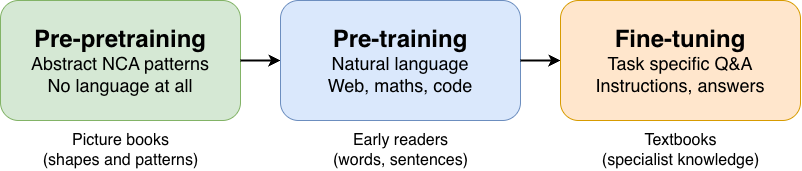

# Training Language Models via Neural Cellular Automata

An interactive [marimo](https://marimo.io) notebook exploring the core ideas of [Training Language Models via Neural Cellular Automata](https://www.alphaxiv.org/abs/2603.10055) (Lee, Han, Kumar, Agrawal — MIT / Improbable AI Lab).



## What's inside

The notebook walks through three parts:

1. **Live demonstration** — Train a TinyGPT model from scratch vs. with NCA pre-pre-training on a digit reversal task. Watch the energy and convergence difference in real time.
2. **NCA mechanics** — Interactive visualizations of how Neural Cellular Automata work, how complexity is measured with gzip, how grids become token sequences, and why their statistics match natural language (Zipf's law).
3. **Paper results** — Convergence curves, domain-matched complexity, weight divergence analysis, and an attention transfer experiment run on your own trained models.

Everything runs on CPU. No GPU required.

## Quickstart

Make sure you have [uv](https://docs.astral.sh/uv/) installed, then:

```bash
uv sync
uv run marimo run main.py
```

To edit the notebook interactively:

```bash
uv run marimo edit main.py
```

## Requirements

- Python ≥ 3.13
- All dependencies are managed by `uv` via `pyproject.toml`

## Author

Created by Magic ([@LAMagicx](https://x.com/LAMagicx)) for the [alphaXiv × marimo competition](https://marimo.io/blog/alphaxiv-competition).
